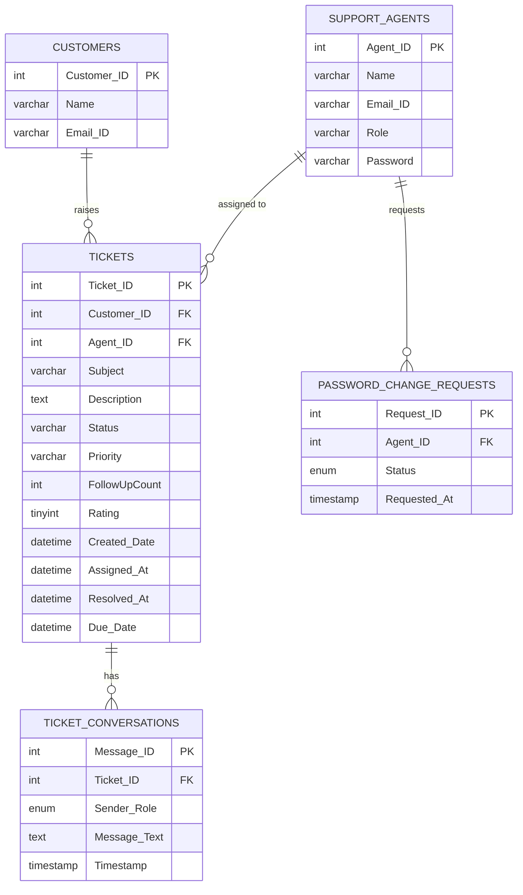

<div align="center">

# 🎧 Customer Support Management System

### A production-grade support portal with AI-powered replies, real-time analytics, and a futuristic glassmorphism interface

<br/>


<br/>


>
> This project goes well beyond a typical student submission, featuring a complete role-based access system, SHA-256 authentication, server-side AI integration, automated email notifications, live analytics charts, customer satisfaction tracking, and SLA-based due date management — all wrapped in a hand-crafted futuristic UI.

</div>

---

## 📋 Table of Contents

- [Overview](#-overview)
- [Features](#-features)
- [Screenshots](#-screenshots)
- [Project Structure](#-project-structure)
- [Database Schema](#-database-schema)
- [Installation & Setup](#-installation--setup)
- [Application Flow](#-application-flow)
- [API Routes](#-api-routes-reference)
- [UI Design](#-ui-design)
- [Tech Stack](#-tech-stack)

---

## 🌐 Overview

The **Customer Support Management System** is a full-stack web application that digitizes and streamlines the entire support lifecycle — from a customer raising an issue to an agent resolving it and collecting satisfaction feedback.

The system supports three distinct user roles: **Customers** who submit and track tickets, **Support Agents** who handle and resolve them, and **Administrators** who oversee the entire operation, assign work, manage the team, and view analytics.

What sets this project apart is the integration of a **Groq-powered LLaMA AI** that assists agents with contextually relevant reply suggestions, a real-time **SLA due date engine** that automatically calculates deadlines based on ticket priority, and a **multi-layer password security system** where agents can only change their passwords after explicit admin approval.

---

## ✨ Features

### 🎫 Customer-Facing Ticketing

Customers interact with the portal without needing an account. They submit support tickets by providing their email, a subject, a description of their issue, and a priority level. The system automatically creates a customer profile if the email is new. Once submitted, a confirmation email is sent instantly.

Customers can search their ticket history at any time using their email and apply filters for status and priority. Each ticket has a dedicated chat interface where the customer can follow the conversation with the assigned agent. If they feel their issue is being ignored, they can click the **Follow Up** button — this increments an urgency counter on the agent's dashboard and re-opens the ticket if it was closed.


---

### 🔐 Security & Authentication

Security was a core design priority throughout this project. Passwords are hashed using **SHA-256** before being stored — plain-text passwords never touch the database. The login system supports a graceful first-time flow where new agents can sign in without a password and are immediately redirected to set one.

The most distinctive security feature is the **admin-gated password change flow for agents**. Unlike typical systems where any user can change their own password freely, agents in this system must first submit a formal change request. The administrator sees all pending requests on their dashboard and can approve or deny each one. The agent receives an email notification either way. Only after approval can the agent actually set a new password. Administrators, however, can change their own passwords at any time without approval.


---

### 👥 Role-Based Access Control

The system enforces strict role separation across all routes and UI elements. The table below summarises exactly what each role can and cannot do:

| Feature | Customer | Agent | Administrator |
|---------|:--------:|:-----:|:-------------:|
| Raise Ticket | ✅ | — | — |
| View Own Ticket History | ✅ | — | — |
| Search Tickets by Email | ✅ | ✅ | ✅ |
| View Staff Dashboard | — | ✅ | ✅ |
| Reply in Ticket Chat | ✅ | ✅ (assigned only) | ✅ |
| Use AI Reply Suggestion | — | ✅ | ✅ |
| Resolve Tickets | — | ✅ (assigned only) | — |
| Assign Tickets to Agents | — | — | ✅ |
| View Admin Report | — | — | ✅ |
| Add New Agents / Admins | — | — | ✅ |
| Approve Password Requests | — | — | ✅ |
| Rate Resolved Tickets | ✅ | — | — |

---

### ⏰ SLA-Based Due Dates & Overdue Alerts

When an administrator assigns a ticket to an agent, the system automatically calculates and records a **due date** based on the ticket's priority level — this is the moment the SLA clock starts ticking. The due date is stored in the database alongside the exact assignment timestamp so that accurate response times can be calculated later.

| Priority | Due in |
|----------|--------|
| 🔴 High | 24 hours from assignment |
| 🟡 Medium | 48 hours from assignment |
| 🟢 Low | 72 hours from assignment |

The dashboard dynamically compares each open ticket's due date against the current time. Tickets approaching their deadline show a **yellow countdown badge**. Tickets that have passed their due date display a **pulsing red OVERDUE badge** — making it impossible for agents to miss critical tickets.


---

### 🤖 AI-Powered Reply Suggestions

Every open ticket chat includes an **"AI Suggest"** button visible only to logged-in staff. Clicking it sends the full ticket context — subject, description, and the entire conversation history — to the **Groq API running LLaMA 3.3 70B** on the server side.

The AI call is deliberately proxied through Flask at `/ai_suggest` rather than called directly from the browser. This means the API key is never exposed in client-side code, network requests, or browser developer tools. The generated reply appears in a highlighted suggestion box, and the agent can click **"Use This Reply"** to instantly populate the message field — editing it before sending if needed.

The AI is prompted to write in the tone of a professional, empathetic customer support agent and is instructed to keep replies to 2–4 sentences so responses stay concise and actionable.

---

### ⭐ Customer Satisfaction Ratings

After a ticket is marked as resolved, the customer receives an email with clickable 1–5 star rating links. They can also rate directly inside the ticket chat without needing email — the rating stars appear only when the ticket is resolved and only when the visitor is **not** a logged-in staff member, ensuring agents and admins cannot manipulate satisfaction scores.

Once rated, the ticket stores the score in the database. The Admin Report aggregates these scores into a **per-agent average rating** and an **overall system satisfaction score** displayed on the dashboard stat card.


---

### 📧 Automated Email Notifications

The email system is built on Python's `smtplib` with Gmail SMTP and is designed to be completely optional — if no SMTP credentials are configured, all email calls silently skip without crashing the app. When configured, the following events trigger automatic emails:

| Trigger | Recipient | Content |
|---------|-----------|---------|
| Ticket raised | Customer | Confirmation with ticket ID and priority |
| Ticket assigned | Agent | Assignment notice with due date |
| New chat message | Other party | Notification to check the portal |
| Follow-up sent | Agent | Urgent nudge notification |
| Ticket resolved | Customer | Resolution notice with rating link |
| Password request approved | Agent | Approval notice with instructions |
| Password request denied | Agent | Denial notification |

---

### 📊 Admin Analytics & Reporting

The Admin Report is a comprehensive one-page dashboard that gives administrators full visibility into the health of the support operation.

The top row displays four stat cards: **Total Tickets** (all time), **Resolved** (with resolution rate percentage), **Open / Pending** (awaiting resolution), and **Avg Satisfaction** (overall star rating across all rated tickets).

Below the stat cards are two live **Chart.js** visualisations: a doughnut chart showing ticket distribution by priority (High / Medium / Low), and a bar chart showing the number of tickets raised per day over the last 7 days.

The **Agent Performance Table** shows every agent's full performance breakdown — tickets assigned, tickets resolved, average customer rating, average response time in hours (calculated from assignment to resolution), and an animated efficiency progress bar.

Finally, an **Add Team Member** form on the right lets administrators register new agents or admins directly from the report page.


---

## 🗂️ Project Structure

```
customer-support-portal/
│
├── app.py                          # Main Flask application — all routes, logic, DB, email, AI
│
├── README.md                       # This file
│
├── screenshots/                    # UI screenshots used in this README
│   ├── home.png
│   ├── login.png
│   ├── dashboard.png
│   ├── conversation.png
│   └── admin_report.png
│
└── templates/                      # Jinja2 HTML templates
    ├── layout.html                 # Base template — navbar, footer, global CSS variables, fonts
    ├── login.html                  # Standalone staff login page (no layout inheritance)
    ├── raise_ticket.html           # Customer home — ticket form + history + track ticket search
    ├── dashboard.html              # Staff dashboard — ticket table, filters, pw requests
    ├── conversation.html           # Per-ticket chat — messages, AI suggest, rating widget
    ├── admin_report.html           # Admin analytics — stat cards, charts, performance table
    └── set_password.html           # Password management — set, change, or request change
```

---

## 🗄️ Database Schema

### ER Diagram

The database consists of five tables. `Customers` and `Support_Agents` are the two actor tables. `Tickets` is the central entity linking both actors together. `Ticket_Conversations` stores the message thread for each ticket. `Password_Change_Requests` manages the admin-gated password change workflow.



### SQL Setup

```sql
CREATE DATABASE CustomerSupportDB;
USE CustomerSupportDB;

-- Stores customer profiles (auto-created on first ticket submission)
CREATE TABLE Customers (
    Customer_ID INT AUTO_INCREMENT PRIMARY KEY,
    Name        VARCHAR(100),
    Email_ID    VARCHAR(100) UNIQUE
);

-- Stores staff accounts with hashed passwords and roles
CREATE TABLE Support_Agents (
    Agent_ID  INT AUTO_INCREMENT PRIMARY KEY,
    Name      VARCHAR(100),
    Email_ID  VARCHAR(100) UNIQUE,
    Role      ENUM('Agent', 'Administrator'),
    Password  VARCHAR(64) NULL
);

-- Core tickets table with SLA tracking columns
CREATE TABLE Tickets (
    Ticket_ID      INT AUTO_INCREMENT PRIMARY KEY,
    Customer_ID    INT,
    Agent_ID       INT NULL,
    Subject        VARCHAR(255),
    Description    TEXT,
    Status         VARCHAR(20) DEFAULT 'Open',
    Priority       VARCHAR(20),
    FollowUpCount  INT DEFAULT 0,
    Rating         TINYINT NULL,
    Created_Date   TIMESTAMP DEFAULT CURRENT_TIMESTAMP,
    Assigned_At    DATETIME NULL,
    Resolved_At    DATETIME NULL,
    Due_Date       DATETIME NULL,
    FOREIGN KEY (Customer_ID) REFERENCES Customers(Customer_ID),
    FOREIGN KEY (Agent_ID)    REFERENCES Support_Agents(Agent_ID)
);

-- Per-ticket conversation messages
CREATE TABLE Ticket_Conversations (
    Message_ID   INT AUTO_INCREMENT PRIMARY KEY,
    Ticket_ID    INT,
    Sender_Role  ENUM('Customer', 'Agent', 'Administrator'),
    Message_Text TEXT NOT NULL,
    Timestamp    TIMESTAMP DEFAULT CURRENT_TIMESTAMP,
    FOREIGN KEY (Ticket_ID) REFERENCES Tickets(Ticket_ID)
);

-- Admin-gated password change requests from agents
CREATE TABLE Password_Change_Requests (
    Request_ID   INT AUTO_INCREMENT PRIMARY KEY,
    Agent_ID     INT NOT NULL,
    Status       ENUM('Pending', 'Approved', 'Denied', 'Done') DEFAULT 'Pending',
    Requested_At TIMESTAMP DEFAULT CURRENT_TIMESTAMP,
    FOREIGN KEY (Agent_ID) REFERENCES Support_Agents(Agent_ID)
);
```

---

## 🚀 Installation & Setup

### Prerequisites
- Python 3.10 or higher
- MySQL 8.0 or higher
- pip

### Step 1 — Clone the repository
```bash
git clone https://github.com/yourusername/customer-support-portal.git
cd customer-support-portal
```

### Step 2 — Install Python dependencies
```bash
pip install flask mysql-connector-python
```

### Step 3 — Set up the database
Run the full SQL from the **SQL Setup** section above, then insert your first administrator account:
```sql
INSERT INTO Support_Agents (Name, Email_ID, Role)
VALUES ('Your Name', 'admin@yourcompany.com', 'Administrator');
```

### Step 4 — Configure the database connection in `app.py`
Open `app.py` and update the `DB_CONFIG` dictionary with your MySQL credentials:
```python
DB_CONFIG = {
    "host":     "localhost",
    "user":     "root",
    "password": "your_mysql_password",
    "database": "CustomerSupportDB",
}
```

### Step 5 — (Optional) Configure AI reply suggestions
Get a **free** API key from [console.groq.com](https://console.groq.com) — no credit card required. Then set it in `app.py`:
```python
GROQ_API_KEY = "gsk_your_key_here"
```

### Step 6 — (Optional) Configure email notifications
To enable automatic email notifications, set up Gmail SMTP. You will need a **Gmail App Password** (not your regular Gmail password).

> Google Account → Security → 2-Step Verification → App Passwords → Generate

```python
SMTP_USER  = "your_gmail@gmail.com"
SMTP_PASS  = "your_16_char_app_password"
EMAIL_FROM = "your_gmail@gmail.com"
```

If these are left blank, the app runs normally — email calls are silently skipped.

### Step 7 — Run the application
```bash
python app.py
```

Open your browser and navigate to **http://localhost:5000**

Log in at **http://localhost:5000/login_page** with your administrator email. Since no password is set yet, leave the password field blank — you'll be redirected to set one on first login.

---

## 🔄 Application Flow

### Customer Flow
```
Visit http://localhost:5000
    ↓
Fill in email, subject, priority, description → Submit Ticket
    ↓
Confirmation email sent to customer
    ↓
Search email in Ticket History → View all tickets with status and priority
    ↓
Click "View Chat" on any ticket → Read agent replies
    ↓
Click "Follow Up" if no response → Urgency counter bumped on agent dashboard
    ↓
Ticket resolved by agent → Customer receives resolution email with rating link
    ↓
Customer rates experience 1–5 stars in chat or via email link
```

### Staff Flow
```
Login at /login_page with email (+ password if set)
    ↓
First login → Redirected to /set_password to create password
    ↓
Dashboard → All tickets sorted by follow-up urgency (most urgent first)
    ↓
[Admin] Select agent from dropdown → Click assign → Due date auto-calculated and set
    ↓
[Agent] Click "Open Chat" on assigned ticket → Read full conversation history
    ↓
Click "AI Suggest" → LLaMA generates contextual reply → Review → "Use This Reply"
    ↓
Edit if needed → Send reply → Customer receives notification email
    ↓
[Agent] Once issue is resolved → Click "Resolve" → Customer notified with rating link
    ↓
[Admin] Visit Admin Report → Review charts, agent stats, satisfaction scores
```

### Agent Password Change Flow
```
Agent clicks "Change Password" in navbar
    ↓
System detects password already set → Shows lock screen
    ↓
Agent clicks "Send Request to Admin"
    ↓
Request logged in database as "Pending"
    ↓
Admin sees pending request panel on their dashboard
    ↓
Admin clicks "Approve" or "Deny"
    ↓
Agent receives email notification with outcome
    ↓
[If Approved] Agent visits /set_password → Password change form unlocked
    ↓
Agent sets new password → Request marked as "Done"
```

---

## 🌐 API Routes Reference

| Method | Route | Description | Access |
|--------|-------|-------------|--------|
| GET | `/` | Home / Raise Ticket page | Public |
| POST | `/raise_ticket` | Submit a new ticket | Public |
| POST | `/search_history` | Search tickets by email with filters | Public |
| GET | `/ticket/<id>/conversation` | View ticket chat thread | Public |
| POST | `/ticket/<id>/conversation` | Send a message in chat | Public / Staff |
| GET | `/follow_up/<id>` | Increment follow-up counter | Public |
| GET | `/rate_ticket/<id>/<rating>` | Submit 1–5 star rating | Customer only |
| GET | `/login_page` | Staff login page | Public |
| POST | `/auth` | Authenticate and create session | Public |
| GET | `/dashboard` | Staff ticket management dashboard | Staff |
| GET | `/admin_report` | Admin analytics and reporting | Admin only |
| POST | `/assign_ticket/<id>` | Assign ticket, set due date | Admin only |
| GET | `/resolve_ticket/<id>` | Mark ticket resolved | Staff |
| GET / POST | `/set_password` | Set or change password | Staff |
| POST | `/request_password_change` | Submit password change request | Agent |
| GET | `/handle_pw_request/<id>/<action>` | Approve or deny request | Admin only |
| POST | `/add_agent` | Register new agent or admin | Admin only |
| POST | `/ai_suggest` | Proxy AI reply suggestion via Groq | Staff |
| GET | `/logout` | Clear session and log out | Staff |

---

## 🎨 UI Design

The entire interface was designed from scratch using a **futuristic glassmorphism** aesthetic without any UI component library — just Bootstrap 5 utilities, custom CSS, and carefully chosen Google Fonts.

The design language is inspired by mission-control dashboards and sci-fi interfaces: deep space backgrounds, subtle grid overlays, glowing cyan accents, and frosted glass cards that feel layered and dimensional.

**Key design decisions:**

- **Color system** uses CSS variables throughout — `--bg-deep: #020818` (background), `--cyan: #00e5ff` (primary accent), `--violet: #7c3aed` (secondary accent). This makes the entire theme consistent and easy to modify.
- **Typography** pairs **Syne** (an aggressive geometric display font) for headings and UI labels with **Inter** for body text — creating contrast between functional and decorative text.
- **Glass cards** use `backdrop-filter: blur(12px)` with `rgba` borders and backgrounds, creating the frosted glass effect without any JavaScript.
- **Ambient glows** are pure CSS `radial-gradient` pseudo-elements on `body::before` — they create depth without impacting performance.
- **Grid overlay** on `body::after` uses a `linear-gradient` background pattern to create the subtle tech grid visible across the entire app.
- **Page transitions** use a single `@keyframes pageEnter` animation applied to `<main>` on every route, giving the app a polished single-page-app feel despite being server-rendered.
- **Custom scrollbar** styled with webkit properties to match the cyan accent color.

---

## 🛠️ Tech Stack

| Layer | Technology | Purpose |
|-------|-----------|---------|
| Backend | Python 3.10+, Flask 2.x | Web framework, routing, session management |
| Database | MySQL 8.0, mysql-connector-python | Data persistence, relational queries |
| Frontend | HTML5, Bootstrap 5.3, Vanilla JS | UI structure, responsive layout, interactivity |
| Templating | Jinja2 | Server-side HTML rendering |
| Fonts | Google Fonts (Syne + Inter) | Typography |
| Icons | Bootstrap Icons 1.11 | UI iconography |
| Charts | Chart.js 4.4 | Analytics visualisations |
| AI | Groq API — LLaMA 3.3 70B | AI-generated reply suggestions |
| Email | Python smtplib, Gmail SMTP | Automated notifications |
| Auth | SHA-256 (hashlib), Flask sessions | Password hashing, session security |

---

